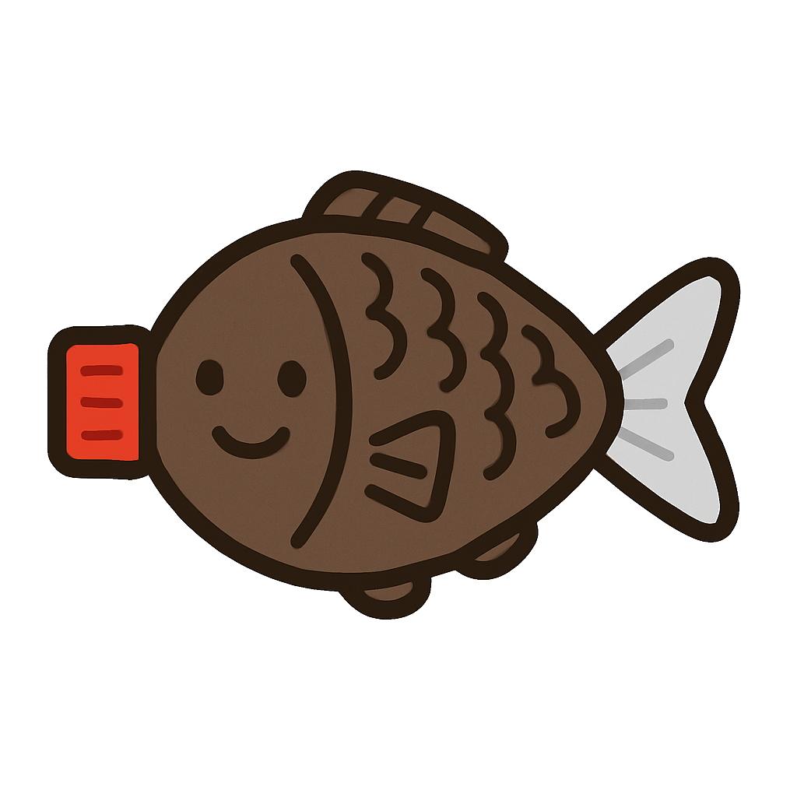

<h1 align="center"><a href="#"></a> Shape-of-You: Fused Gromov-Wasserstein Optimal Transport for Semantic Correspondence in-the-Wild</h1>

<div align="center">
  Jiin Im · Sisung Liu · Je Hyeong Hong
</div>

<p align="center">
  <b>Spatial AI Lab @ Hanyang University</b><br>
  CVPR 2026
</p>

<div align="center">
  <a href="#"></a>
  <a href="#"></a>
  <a href="#"></a>
</div>

---

This repository is the official implementation of **"Shape-of-You: Fused Gromov-Wasserstein Optimal Transport for Semantic Correspondence in-the-Wild"**.

**The paper and official code will be released soon.**

## 🚀 Introduction

We propose **Shape-of-You**, a novel approach to semantic correspondence using Fused Gromov-Wasserstein (FGW) optimal transport. Our method effectively captures both appearance and geometric structures for robust matching in-the-wild.

## 📅 Roadmap
- [ ] Release paper on arXiv
- [ ] Release inference code and pretrained weights
- [ ] Release training code

## 🎓 Citation

```bibtex
@inproceedings{im2026shapeofyou,
  title={Shape-of-You: Fused Gromov-Wasserstein Optimal Transport for Semantic Correspondence in-the-Wild},
  author={Im, Jiin and Liu, Sisung and Hong, Je Hyeong},
  booktitle={Proceedings of the IEEE/CVF Conference on Computer Vision and Pattern Recognition (CVPR)},
  year={2026}
}
